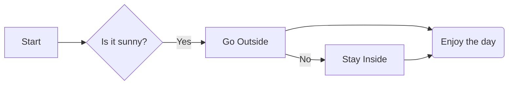
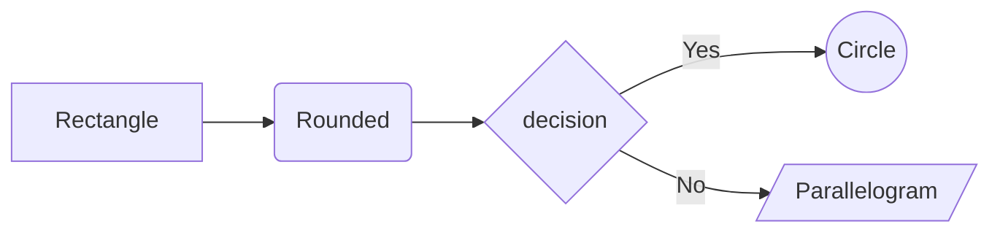
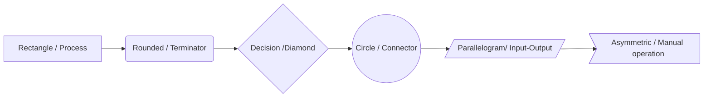
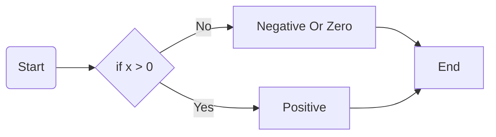
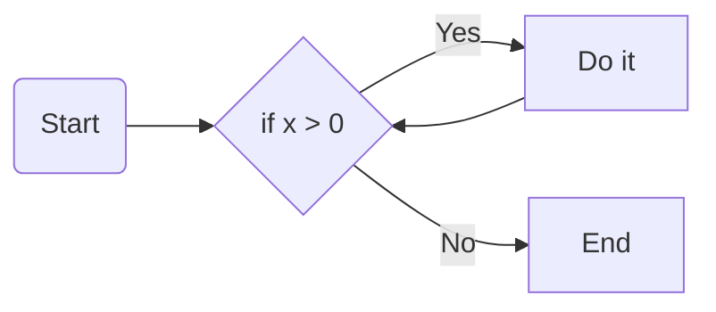
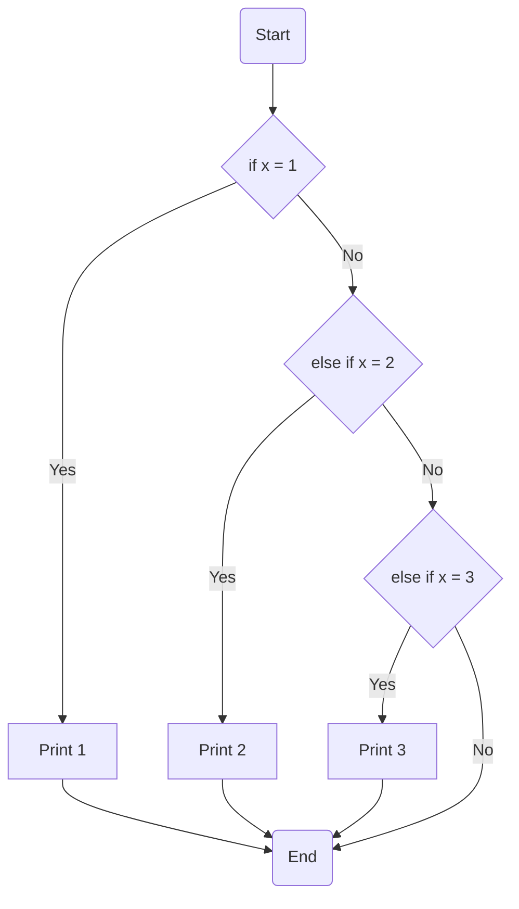
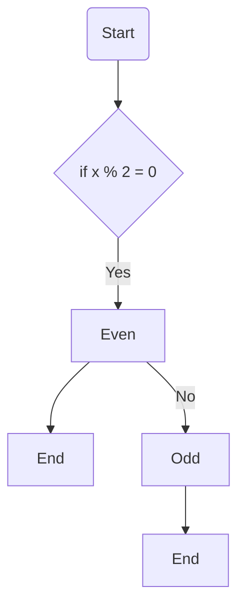
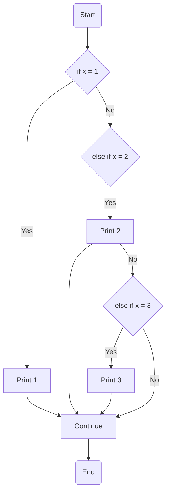

# Mermaid Syntax
LR Means Left to Right, TD means Top to Down, graph for flowCharts
`{}` give diamond, decision shape, `[]` rectangle, `()`, rounded, `[//]`
gives parallelogram, `(())` gives circle, `> ]` asymmetric shape

