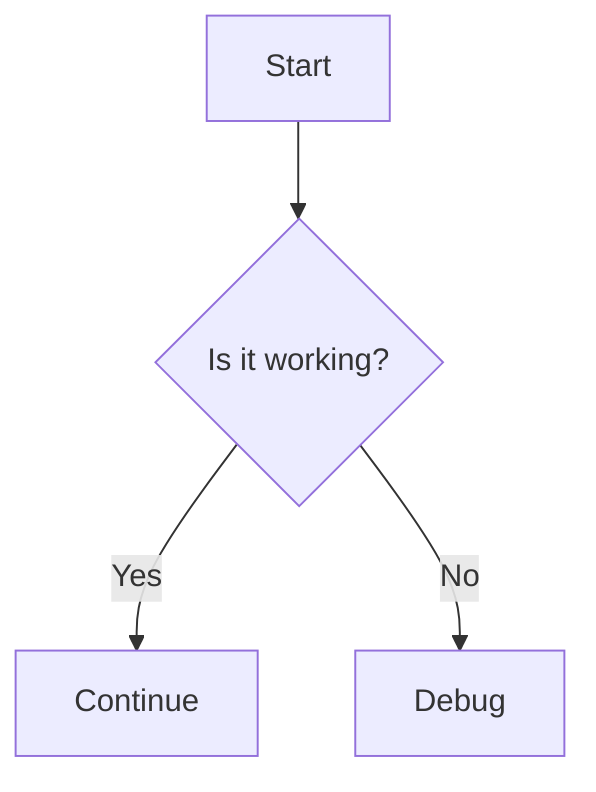
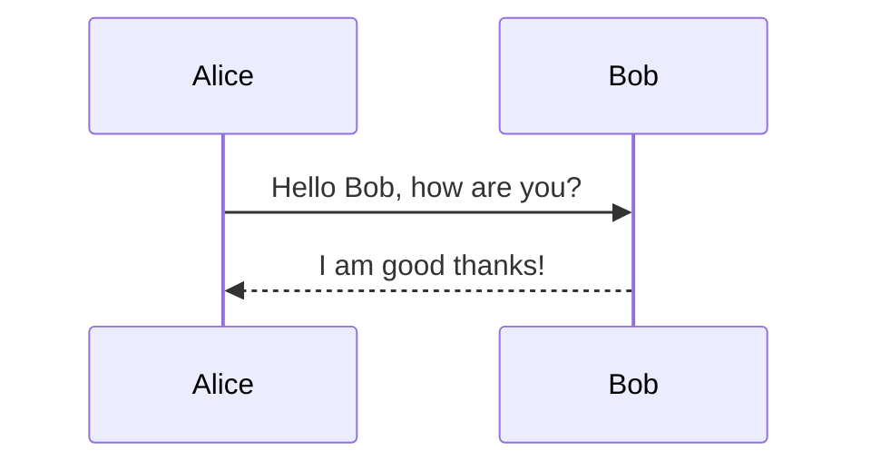

# Markdown Cheat Sheet for Developers

This cheat sheet provides a comprehensive guide to Markdown, including all major syntax features, advanced formatting, code blocks, tables, and integrations like Mermaid diagrams, MathJax, and more. Tailored for GitHub and developer workflows.

---

## 1. Headings

Use `#` for headings. Up to 6 levels supported.

```markdown
# H1 Heading
## H2 Heading
### H3 Heading
#### H4 Heading
##### H5 Heading
###### H6 Heading
```

# H1 Heading  
## H2 Heading  
### H3 Heading  
#### H4 Heading  
##### H5 Heading  
###### H6 Heading  

---

## 2. Emphasis

```markdown
*Italic* or _Italic_
**Bold** or __Bold__
***Bold & Italic*** or ___Bold & Italic___
```

*Italic*  
**Bold**  
***Bold & Italic***  

---

## 3. Lists

### Unordered List

```markdown
- Item 1
  - Subitem 1
    - Sub-subitem
- Item 2
* Item 3
+ Item 4
```
- Item 1  
  - Subitem 1  
    - Sub-subitem  
- Item 2  
* Item 3  
+ Item 4  

### Ordered List

```markdown
1. First
2. Second
   1. Sub-second
3. Third
```
1. First  
2. Second  
   1. Sub-second  
3. Third  

---

## 4. Task Lists (GitHub Flavored)

```markdown
- [x] Write documentation
- [ ] Refactor code
```
- [x] Write documentation  
- [ ] Refactor code  

---

## 5. Blockquotes

```markdown
> This is a blockquote
>> Nested blockquote
```
> This is a blockquote  
>> Nested blockquote  

---

## 6. Code

### Inline Code

```markdown
Use the `print()` function.
```
Use the `print()` function.

### Code Blocks

<details>
<summary>Syntax</summary>

<pre>
<code>
```language
your code here
```
</code>
</pre>
</details>

```python
def hello():
    print("Hello, Markdown!")
```

### Fenced Code Block (No Language)

```
No syntax highlighting.
```

---

## 7. Links

### Inline

```markdown
[GitHub](https://github.com)
```
[GitHub](https://github.com)

### Reference

```markdown
[GitHub][gh]

[gh]: https://github.com
```
[GitHub][gh]

[gh]: https://github.com

---

## 8. Images

```markdown

```


---

## 9. Tables

```markdown
| Syntax | Description |
|--------|-------------|
| Header | Title       |
| Paragraph | Text     |
```
| Syntax    | Description |
|-----------|-------------|
| Header    | Title       |
| Paragraph | Text        |

### Alignment

```markdown
| Left | Center | Right |
|:-----|:------:|------:|
| a    |   b    |     c |
```
| Left | Center | Right |
|:-----|:------:|------:|
| a    |   b    |     c |

---

## 10. Horizontal Rule

```markdown
---
***
___
```
---
***
___

---

## 11. HTML in Markdown

Markdown supports inline HTML.

```markdown
<b>Bold HTML</b>
<span style="color: red">Red Text</span>
```
<b>Bold HTML</b>  
<span style="color: red">Red Text</span>

---

## 12. Escaping Characters

```markdown
\*literal asterisks\*
```
\*literal asterisks\*

---

## 13. Footnotes (GFM/Some Parsers)

```markdown
Here is a footnote.[^1]

[^1]: This is the footnote.
```
Here is a footnote.[^1]

[^1]: This is the footnote.

---

## 14. Strikethrough (GFM)

```markdown
~~Mistake~~
```
~~Mistake~~

---

## 15. Emoji (GFM)

```markdown
:smile: :rocket:
```
:smile: :rocket:

---

## 16. Mentions (GitHub Flavored)

```markdown
@username
#123
```
@username  
#123  

---

## 17. Syntax Highlighting Languages

Supported: `python`, `js`, `json`, `bash`, `html`, `css`, `cpp`, etc.

```javascript
console.log("Hello World");
```

---

## 18. Mermaid Diagrams (GFM/Supported Editors)




---

## 19. MathJax / LaTeX (Some Parsers, GitHub PRs/Issues)

Inline: ``$E = mc^2$``  
Block:

```markdown
$$
\int_0^\infty e^{-x} dx = 1
$$
```
$$
\int_0^\infty e^{-x} dx = 1
$$

---

## 20. Collapsible Sections (Details Tag)

```markdown
<details>
  <summary>Click to expand!</summary>
  More details here...
</details>
```
<details>
  <summary>Click to expand!</summary>
  More details here...
</details>

---

## 21. TOC (Table of Contents)

Some platforms auto-generate TOCs from headings. Or use plugins.

---

## 22. Frontmatter (YAML/Metadata)

```markdown
---
title: My Markdown Doc
tags: [dev, cheat-sheet]
---
```

---

## 23. Advanced GitHub Features

- **@mentions**: Notify users.
- **References**: Issues, PRs (`#123`, `owner/repo#456`)
- **Checkboxes**: Track tasks.
- **Emoji**: Use `:emoji:`.
- **Images/GIFs**: For demos, screenshots.
- **Linking**: To files, lines, commits.

---

## 24. Useful Resources

- [GitHub Markdown Guide](https://guides.github.com/features/mastering-markdown/)
- [CommonMark Spec](https://spec.commonmark.org/)
- [Mermaid Docs](https://mermaid-js.github.io/mermaid/#/)
- [MathJax Docs](https://docs.mathjax.org/en/latest/)
- [Markdown Emoji](https://www.webfx.com/tools/emoji-cheat-sheet/)

---

## 25. Sample: Combining Features

```markdown
## Project Status :rocket:

- [x] Initial setup
- [x] Documentation
- [ ] Add Mermaid diagrams

> **Note:** See [CONTRIBUTING.md](CONTRIBUTING.md) for guidelines.

```python
def main():
    # TODO: implement logic
    pass
```


```

---

**Tip:** Experiment with Markdown in GitHub READMEs, issues, discussions, and PRs for best results!
